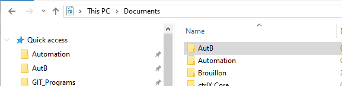
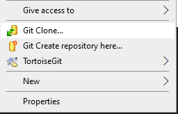
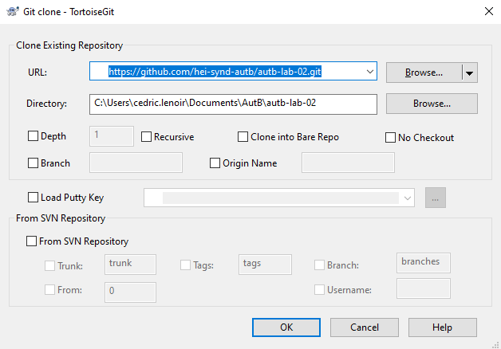
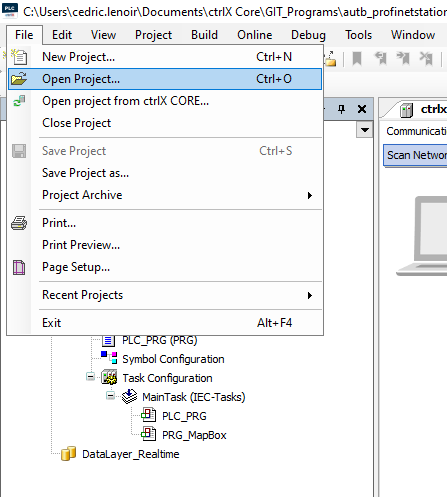
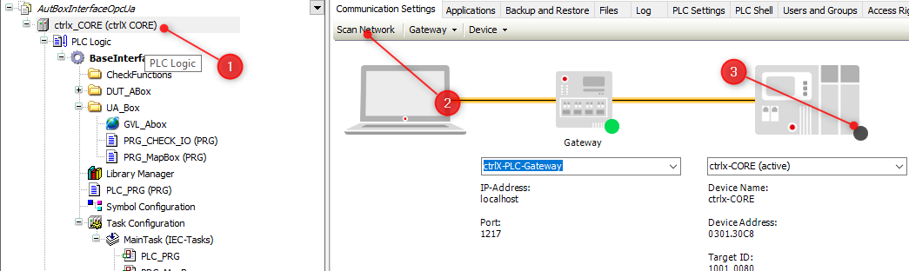
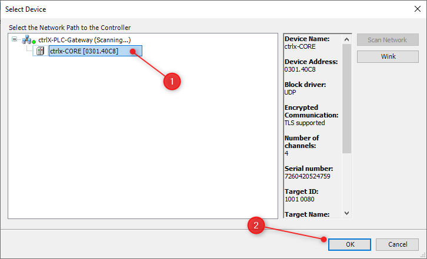

# This is a quick start for ctrlX PLC

Create a folder AutB in Documents.
Pin it to Quick Access.

<figure>
    
    <figcaption>Quick start to AutB</figcaption>
</figure>

> By default, folder Automation is reserved for Siemens S7.

<figure>
    
    <figcaption>Clone With Tortoise Git</figcaption>
</figure>

<figure>
    
    <figcaption>Select Source And Destination For Project</figcaption>
</figure>

Launch program ctrlX PLC Engineering

<figure>
    
    <figcaption>ctrlX PLC Engineering.png</figcaption>
</figure>

<figure>
    
    <figcaption>Open Project From AutB</figcaption>
</figure>

Lab_XX.project

Scan network to connect IDE with ctrlX Core.
A the end of the process the ctrlX (3) should be green too.

<figure>
    
    <figcaption>Scan Network For CtrlX</figcaption>
</figure>

<figure>
    
    <figcaption>Select Device ctrlx-CORE</figcaption>
</figure>

Enter password to log to ctrlX Core
<figure>
    
    <figcaption>Device User Logon</figcaption>
</figure>

Enter password to log to ctrlX Core
<figure>
    
    <figcaption>Generate Code Login Start Program</figcaption>
</figure>

Ready !