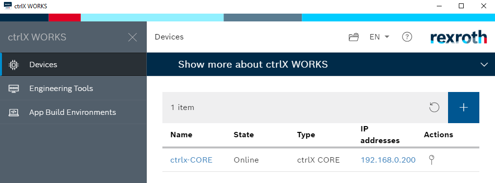

<h1 align="left">
   
  
   
  HEI-Vs Engineering School - Industrial Automation Base
   
</h1>

Cours AutB

# This is a quick start for ctrlX PLC

How to check if systems are connected, [at the end of this document](#check-if-system-is-connected).

## Get Lab from Git

Create a folder AutB in Documents.
Pin it to Quick Access.

<figure>
    
    <figcaption>Quick start to AutB</figcaption>
</figure>

> By default, folder Automation is reserved for Siemens S7.

<figure>
    
    <figcaption>Clone With Tortoise Git</figcaption>
</figure>

<figure>
    
    <figcaption>Select Source And Destination For Project (Select lab number)</figcaption>
</figure>

## Load archive from folder and upload program on target

Launch program ctrlX PLC Engineering

<figure>
    
    <figcaption>ctrlX PLC Engineering.png</figcaption>
</figure>

<figure>
    
    <figcaption>AutB Extract From Archive</figcaption>
</figure>

<figure>
    
    <figcaption>Select Student version with .projectarchive extension</figcaption>
</figure>

**.projectarchive** is to be seen as a *.zip* of all files you need for your project

Many possibilies, you can try this:
<figure>
    
    <figcaption>Select where you want your project</figcaption>
</figure>

Scan network to connect IDE with ctrlX Core.
Double click on (1)

A the end of the process the ctrlX (3) should be green too.

<figure>
    
    <figcaption>Scan Network For CtrlX</figcaption>
</figure>

<figure>
    
    <figcaption>Select Device ctrlx-CORE</figcaption>
</figure>

Enter password to log to ctrlX Core
<figure>
    
    <figcaption>Device User Logon</figcaption>
</figure>

Enter password to log to ctrlX Core
<figure>
    
    <figcaption>Generate Code Login Start Program</figcaption>
</figure>

Ready !

# Check if system is connected

## Check if ctrlX Core is connected or ready.

<figure>
    
    <figcaption>Open program ctrlX Works</figcaption>
</figure>

<figure>
    
    <figcaption>CtrlX Works show you list of ctrlX Cores connected to your PC</figcaption>
</figure>

Click on ctrlX Core, it opens it in a Browser.
You will need login: **boschrexroth** and password: **boschrexroth** to connect.
*Maybe you need to select advanced and access unsage to connect.*

When you are connected you have access to the core.

<figure>
    
    <figcaption>You can see and reset alarms here</figcaption>
</figure>

## Check is Siemens S7 is connected and running