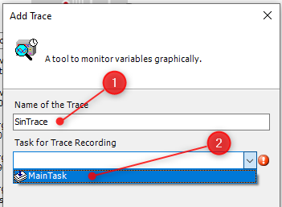

<h1 align="left">
   
  
   
  HEI-Vs Engineering School - Industrial Automation Base
   
</h1>

Cours AutB

# CtrlX PLc Trace

If a OPC UA Tool can be usefull to display the general form of a signal, it is not accurate and/or quick enough to display a signal generated at 10 [ms] or less.

A trace tool is a little bit different. It store a signal in the memory of the PLC, then you can load the trace immediately or latter.

Here the different steps to trace a signal, for example, the sin of LAB 01.

<figure>
    
    <figcaption>Add a trace object in the PLC with name BaseInterfaceUa</figcaption>
</figure>

<figure>
    
    <figcaption>Give a name to the trace and select a task to record it</figcaption>
</figure>

> The task should be ideally the task where your program is working, it is more easy to interprete.

<figure>
    
    <figcaption>Add the variable you want to trace...</figcaption>
</figure>

<figure>
    
    <figcaption>Scroll the PLC_PRG to find your variables</figcaption>
</figure>

<figure>
    
    <figcaption>Download the trace</figcaption>
</figure>

> If you trace the sin signal of LAB 01, you can check the frequency, the amplitude and the sample time of the signal.

<figure>
    
    <figcaption>Interpret the result and check your algorithm!</figcaption>
</figure>