<h1 align="left">
  <br>
  
  <br>
  HEI-Vs Engineering School - Industrial Automation Base
  <br>
</h1>

Cours AutB

Author: [Cédric Lenoir](mailto:cedric.lenoir@hevs.ch)

# LAB 00 Quick Start, a kind of Hello PLC World!

*Keywords:* **IDE OPC UA  HMI FUNCTION BLOCK CYCLIC TASK**

# Objectif
Prendre en main le système de développement qui sera utilisé pendant le semestre et découvrir quelques bases qui seront approfondies dans la suite du semestre, que ce soit en pratique ou en théorie. En résumé:
- Ecrire un mini programme **PLC**.
- Etablir une communication **OPC UA** entre le **PLC** et un **HMI**.
- Afficher des informations en provenance du **PLC** et envoyer des commandes.

# Hardware
Sous le nom ctrlX Core on trouve un système d'expoitation Linux real-time sur base Ubuntu embarqué dans une commande électrique d'axe. Processeur 64 Bit Quad Core ARM.

<figure>
    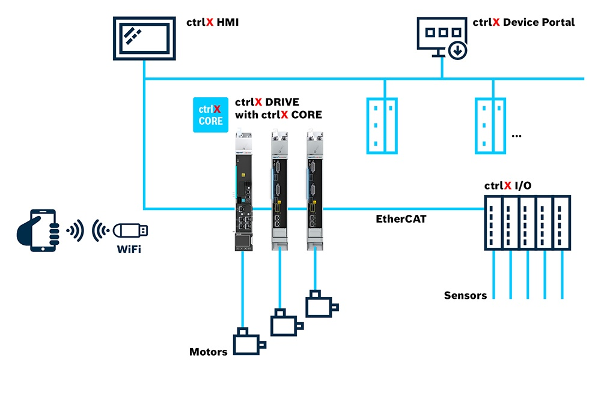
    <figcaption>CtrlX CORE Architecture drive based</figcaption>
</figure>

# Logiciels

## ctrlX WORKS
*Version of ctrlX WORKS when writing this document:* **1.12.10**

ctrlX WORKS est une suite logicielle destinée à programmer et gérer un ensemble ctrlX Core:

## ctrlX WORKS - Device Management

Gestion générale des appareils, **réels ou virtuels**, connectés sur le PC de développement.

<figure>
    
    <figcaption>ctrlX WORKS - Device Management</figcaption>
</figure>

### ctrlX PLC Engineering

Environement de développement, **Integrated Development Environment**, IDE, en language PLC IEC **61131-3**.

<figure>
    
    <figcaption>ctrlX PLC Engineering</figcaption>
</figure>

La partie PLC n'est qu'une des composantes du système.

<figure>
    
    <figcaption>ctrlX CORE PLC Runtime Overview</figcaption>
</figure>

La partie PLC n'est qu'une des composantes du système. On pourrait parfaitement décider de piloter les axes à partir d'autres environnements.

## Prosys OPC UA Monitor

<figure>
    
    <figcaption>Prosys Opc Ua Monitor Icon</figcaption>
</figure>

### OPC UA
OPC UA est un standard d'échange d'information basé sur le principe client-serveur, complété d'un système de partage du modèle de l'information, qui utilise le support Ethernet pour le transport.

1. Dans notre configuration, le serveur est le PLC.
2. Dans notre configuration, le client est le HMI.

### HMI
HMI pour Human Machine Interface. Dans la pratique, les HMI actuels sont souvent développées sur des technologies WEB, HTML, Java Script qui ne sont pas des technologies qui font partie du programme SYND, Systèmes Industriels.

Actuellement, de plus en plus de solutions de HMI sont basée sur des notions de **Low Code** ou **No Code**. La solution proposée dans le cadre des travaux pratiques est une solution **No Code**. Elle offre la possibilité d'accéder aux données du PLC via OPC UA sans qu'il ne soit nécessaire d'écrire une seule ligne de code.

La solution proposée est la version libre, donc limitée d'une solution industrielle. Le prix d'une licence correspond à environ une demi-journée de travail pour un ingénieur et sera suffisante pour beaucoup d'applications simples.

<figure>
    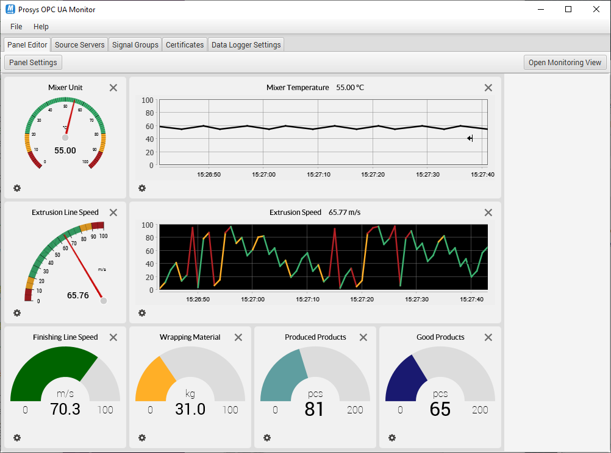
    <figcaption>Prosys Opc Ua Monitor</figcaption>
</figure>

# Hello World du PLC

## Password
Nous aurions pu supprimer au maximum les mots de passe d'accès. **Ce n'est pas la tendance de l'automation actuelle**.

Nous avons toutefois laissé les mots de passe par défaut des systèmes: Soit:

- Username: **boschrexroth**
- Password: **boschrexroth**

Le "Hello World" du PLC consiste à écrire un compteur dans un tâche et vérifier que la tache est exécutée grâce à l'incrément du compteur.

1. Ouvrir ctrlX Works
2. Sélectionner le PLC, réel ou virtuel sur lequel on veut travailler.
3. Sélectionner l'App PLC et lancer ctrlX PLC Engineering.

## Ecrire un premier programme

```iecst
PROGRAM PLC_PRG
VAR
	iCount    : INT := 3;
END_VAR

iCount := iCount + 1;
```

> Dans l'environnement de programmation, la partie supérieure de la fenêtre d'un programme sert à définir les variables, la partie inférieure à écrire le code.

<figure>
    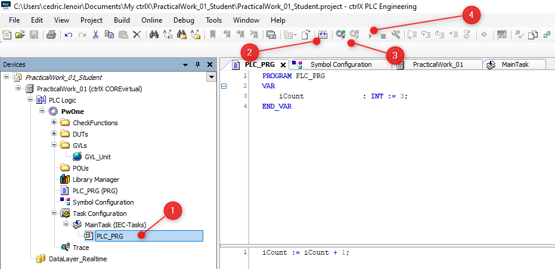
    <figcaption>My First Program In Four Steps</figcaption>
</figure>

1. Select PLC_PRG and write code for counter.
2. Compilation.
3. Download 
4. Run

<figure>
    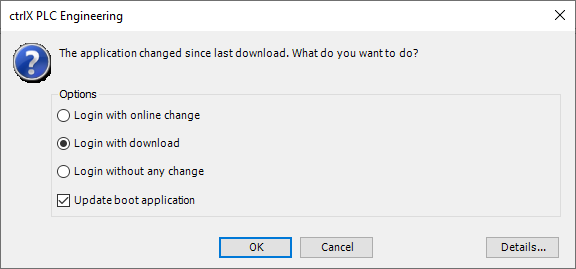
    <figcaption>Select: Login with download</figcaption>
</figure>

# Connecter l'interface utilisateur HMI, pour *Human Machine Interface*.

## Configurer la connexion du côté PLC *Programmable Logic Ineterface.*
Pour qu'une variable soit accessible depuis l'extérieur, il faut en informer le compilateur, en particulier pour qu'il la mette à disposition dans le **Node Space** OPC UA.

> Si l'icône **Symbol Configuration** n'est pas présente, il faut l'ajouter en allant dans IDE --> Tab --> Project --> Add Object --> Symbol Configuration...

<figure>
    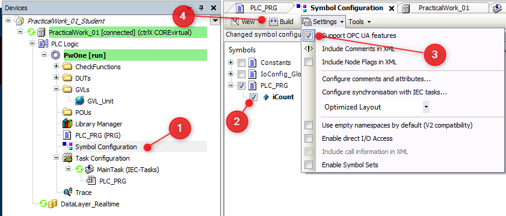
    <figcaption>Configure Symbol Configuration</figcaption>
</figure>

> La configuration du symbole modifié sera transférée lors du prochain téléchargement ou de la modification en ligne..

1. Sélectionner *Symbol Configuration*
2. Vérifier iCount
3. Vérifier si **Support OPC UA features** est coché.
4. Build.
5. La variable sera disponible sur l'espace d'adressage OPC après le prochain téléchargement.

## Connecter le HMI à l'espace d'adresses de l'OPC UA
L'accès au PLC n'est pas nécessairement trivial. Un partie de la complexité de l'OPC UA est le résultat de ces principales qualités:

1. L'accès est protégé par un mot de passe.
2. La sécurité est complétée par un échange de certificats.
3. Les données sont cryptées entre le serveur et le client.

> Comme on l'a vu dans **Symbol Configuration**, c'est le programmeur du PLC qui décide quelles sont les variables accessibles. Il suffit ensuite au programmeur du HMI de se connecter à l'espace d'addresses de l'OPC UA pour **découvrir quelles sont les variables à disposition**.

Lancer **Prosys OPC UA Monitor** et sélectionner **Source Servers**.
<figure>
    
    <figcaption>Prosys Opc Ua Monitor Icon</figcaption>
</figure>

### Connection Address
```opc.tcp://```IP Address```:4840``` 

- ``opc.tcp://`` signifie accès via TCP, ce qui est en général toujour le cas.
- L'adresse IP peut être sous forme de texte, par exemple ```localhost```, mais plus souvent sous la forme ``xxx.xxx.xxx.xxx``, par exemple ``192.168.0.200`` pour les ctrlX Core des drives.
- ``4840`` est le numéro de port par défaut pour OPC UA, mais il pourrait être modifié si nécessaire. Par exemple si plusieurs serveurs sont disponibles à la même adresse.

<figure>
    
    <figcaption>Add New Source Server Connection</figcaption>
</figure>

#### Certificat client
Vous pourriez avoir à valider le certificat Prosys dans l'environnement CTRLx Core.

In ctrlX Core --> Settings --> Certificates & Keys --> OPC UA Server

<figure>
    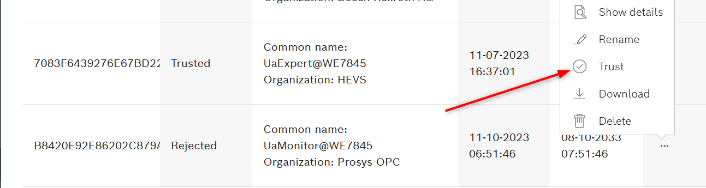
    <figcaption>Trust Opc Ua Prosys Certificate</figcaption>
</figure>

> Vous devez accepter le certificat du serveur et vérifier sa place sur votre PC dans l'onglet Certificats de Prosys OPC UA Monitor.

> Dans de nombreux systèmes, comme pour Prosys, il existe un **dossier rejeté**, il est parfois nécessaire de déplacer un certificat de ce dossier vers ``.\PKI\CA\certs`` pour permettre une connexion. 

### Select signal in Addess Space
Sélectionner l'onglet **Signal Group**, puis dans **Address Space**, rechercher la variable ``iCount`` parmi toutes les informations que l'OPC UA du ctrlX Core met à disposition par défaut.

<figure>
    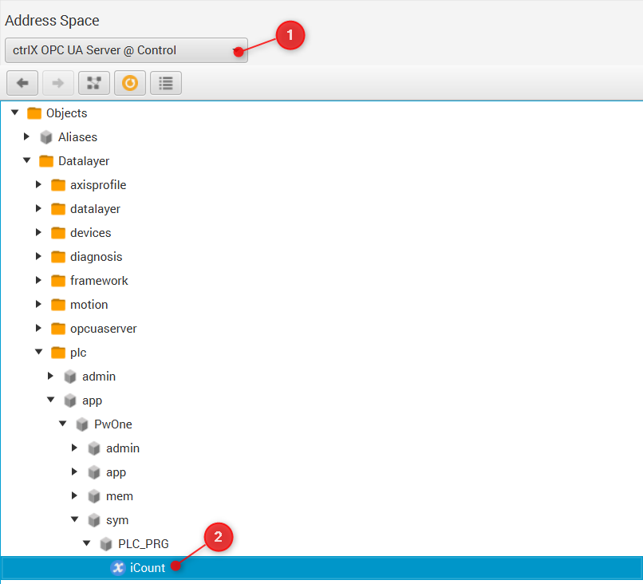
    <figcaption>Find iCount In The Address Space Of Opc Ua</figcaption>
</figure>

<figure>
    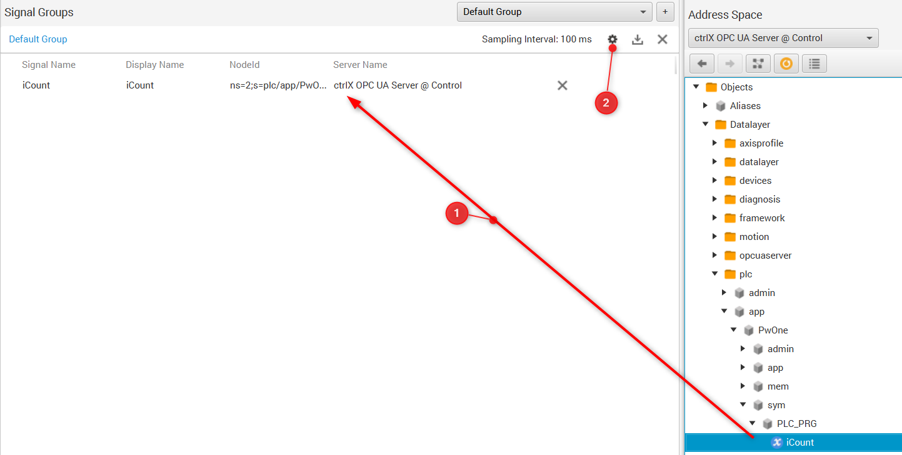
    <figcaption>Drag And Drop Signal To Signal Group</figcaption>
</figure>

### Panel Editor
1. Dans l'éditeur de panneau, sélectionnez un **+** pour sélectionner le **Nom du signal** de ``iCount`` et soyez libre de configurer le type de jauge et les paramètres de votre choix.

2. Ouvrez *Monitoring View*.

<figure>
    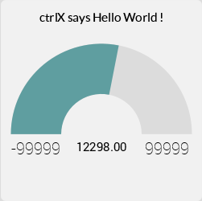
    <figcaption>CtrlX Says Hello World !</figcaption>
</figure>

**Your firt program is ready !**

# Lien vers le hardware
Nous ne sommes pas en simulation, nous devons connecter notre logiciel avec du matériel.

> Le système est un peu particulier, c'est un choix historique, une partie du matériel était existant avant l'aquisition des robots et de leur PLC intégré, nous avons donc du trouver un moyen de lier l'ancien matériel avec le nouveau.

> L'ensemble des outils de communication du CTRLx Core ne sont pas en version définitive. C'est le cas de **Profinet** qui permet de garantir une communication cyclique stricte avec les capteurs et actuateur. **Nous avons du bricoler un peu** en utilisant **OPC UA** qui n'est pas conçu pour garantir un temps de cycle stable.

> Profinet et OPC UA seront abordés plus tard dans le cours.


## Programmer un bouton poussoir
Dans cette partie, nous allons écrire un petit programme pour démarrer et arrêter le convoyeur avec deux boutons poussoirs.
1. Il y a un bouton poussoir **start**.
2. Le convoyeur ne démarre qu'au front montant du bouton, c'est-à-dire que si le bouton reste enfoncé, le convoyeur ne redémarre pas après un arrêt.
3. Il y a un bouton poussoir **stop**, avec le même comportement que le bouton start.

> Les fronts montants ou descendants sont des classiques de la programmation **PLC**. Il existe deux blocs fonctionnels pour cela. R_TRIG et F_TRIG.

-   R_TRIG pour Rise Trigger, flanc montant.
-   F_TRIG pour Fall Trigger, flanc descendant.

Nous utiliserons deux **R_TRIG** pour détecter les fronts montants des boutons.

Ajoutez deux blocs fonctionnels dans vos variables

```iecst
PROGRAM PLC_PRG
VAR
	...
	rTrigStart	: R_TRIG;
	rTrigStop   : R_TRIG;
END_VAR
```

Ajoutez ensuite ce qui suit dans votre code

```iecst

(*
	Declaration of all FB at the end of the code, this is a good practice.
	You can lose one cycle but the program is more readable.

    But !
    Triggers are exceptions:
        because the output .Q is only active in the current cycle
*)
rTrigStart(CLK:=GVL_Abox.uaAboxInterface.uaButtonAndSignal.In_Start);
rTrigStop(CLK:=GVL_Abox.uaAboxInterface.uaButtonAndSignal.In_Stop);

IF rTrigStart.Q THEN
	TagOut.K1_DirectionOutput := TRUE;
END_IF

IF rTrigStop.Q THEN
	TagOut.K1_DirectionOutput := FALSE;
END_IF

```
Complete your **Symbols** and **HMI** to Start/Stop the conveyor.

<figure>
    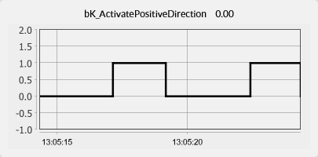
    <figcaption>Monitor Activation Of Conveyor</figcaption>
</figure>

> Observez **très attentivement** le comportement de votre graphe !

1. OPC UA n'est **pas en temps réel**.
2. OPC UA n'est **pas cyclique**.
3. OPC UA envoie les données **uniquement lorsqu'elles changent**.
4. OPC UA n'est **pas conçu pour le contrôle**, mais pour l'IHM, les paramètres ou les données sans exigences de synchronisation strictes.

> Il existe de nombreuses études avec une extension d'OPC UA, **OPC UA PubSub** qui est différente du modèle client-serveur classique. L'objectif est d'utiliser OPC UA PubSub avec des réseaux Ethernet en temps réel. Par exemple : [OPC UA PubSub sur TSN pour la communication industrielle en temps réel](./pdf/OPC%20UA%20PubSub%20over%20TSN%20for%20Realtime%20Industrial%20Communication.pdf). **En 2024, aucune application commerciale n'est encore disponible**.

# Prochaine étape, programmer une minuterie
Le **Timer** est un autre bloc fonctionnel typique de la programmation **PLC**. Vous en utiliserez un pour régler un **Timer** afin d'arrêter le convoyeur après un laps de temps donné.

## Complétez votre code comme ça :

```iecst
PROGRAM PLC_PRG
VAR
    ...

	// To stop conveyor after a selected time if active.
	tonConveyorStop : TON;
END_VAR
```

```iecst

(*
    Note the OR used to stop with two different conditions.
*)
IF rTrigStop.Q       OR
   tonConveyorStop.Q THEN
	TagOut.K1_DirectionOutput := FALSE;
END_IF

(*
	Declaration of all FB at the end of the code, this is a good practice.
	You can lose one cycle but the program is more readable.
*)
...
tonConveyorStop(IN := TagOut.K1_DirectionOutputn,
                PT := T#2S);
```
> **PT** pour **Heure programmée**. Notez le format ``T#``*valeur*``unité``

> **Q** pour **Bit de sortie** est utilisé car le **O**, *la lettre* pourrait être confondu avec un **0**, *la valeur*. Pour les valeurs binaires, ``BOOL``, **nous préférons ``TRUE`` et ``FALSE``** dans la programmation automate, même si 0 et 1 pourraient également être utilisés.

## Utiliser le temps écoulé ET sur un graphique
Le bloc fonctionnel ``TON`` en tant que sortie ``ET`` pour surveiller le temps écoulé depuis l'activation de la minuterie jusqu'à ce que la sortie ``Q`` soit définie sur ``TRUE``.

Complétez le code, les symboles et OPC UA Monitor pour afficher quelque chose comme ça.

<figure>
    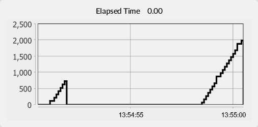
    <figcaption>Monitor Elapsed Time</figcaption>
</figure>

# Finaly, write a sinus generator
The goal is to understand the difference between a signal you could generate with a Matlab script with a *for loop*, and a signal with the PLC which **IS** a form of continous loop, that is, you do not have to use a *for loop*.

- Amplitude of the signal must be ``24 [Vdc]``.
- Frequency of the signal must be ``0.5 [Hz]``.
- The SIN function in PLC works like the sin function in Matlab, in radians.
- Pi is given as a constant.

> An example of script with Matlab is given below, you just have to thing about the evolution of the angle depending of the cycle time to get ``0.5 [Hz]``.

<figure>
    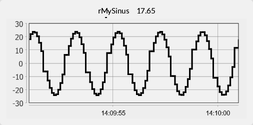
    <figcaption>Monitor Sinus</figcaption>
</figure>

You have to check the cycle time of the task to be ``10 [ms]``.
<figure>
    
    <figcaption>Check Task Cycle Time</figcaption>
</figure>

### Complétez votre code avec les variables données
> PI est une constante, vous pouvez compléter la précision si vous le souhaitez.

```iecst
PROGRAM PLC_PRG
VAR
    ...
	rMyValue_rad		: REAL;
    rMySinus            : REAL;
END_VAR

VAR CONSTANT
	rMyPi			    : REAL := 3.1416;    
END_VAR
```

### The Matlab script with its output.
```Matlab
mySinus = 1:1:200;

for i = 1:200
    myAngle_rad = 2 * pi * i / 50;
    mySinus(i) = 24 * sin(myAngle_rad);
end

plot(mySinus), grid on
```

<figure>
    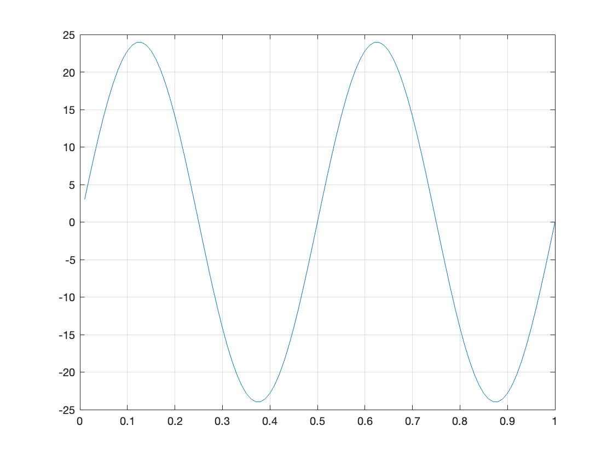
    <figcaption>Matlab Plot Sinus</figcaption>
</figure>

# Rapport
> Il n'y a pas de rapport pour ces travaux pratiques, mais **les travaux pratiques sont censés être compris. Cela fait partie de la théorie**.

> Sur demande, le logiciel utilisé ici peut être fourni pour une installation sur votre ordinateur portable. Windows uniquement, pour ctrlX Works.

> A la fin du cours, vous devriez être capable d'écrire du code structuré simple dans n'importe quel éditeur de texte.