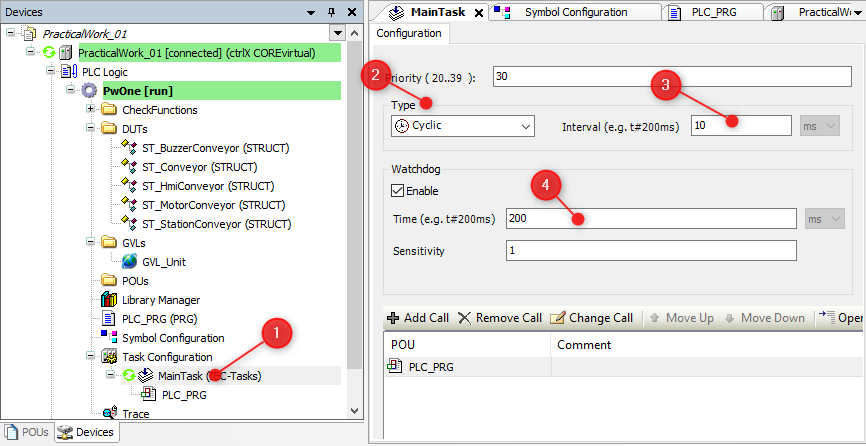

<h1 align="center">
  <br>
  
  <br>
  HEI-Vs Engineering School - Industrial Automation Base
  <br>
</h1>

Cours AutB

Author: [Cédric Lenoir](mailto:cedric.lenoir@hevs.ch)

## Attention, plus à jour, [passer à la version française](PW01_QuickStart_fr.md).

# Practical Work 01 - Quick Start

*Keywords:* **IDE OPC UA  HMI FUNCTION BLOCK CYCLIC TASK**

# Objectif
Prendre en main le système de développement qui sera utilisé pendant le semestre et découvrir quelques bases qui seront approfondies dans la suite du semestre, que ce soit en pratique ou en théorie. En résumé:
- Ecrire un mini programme **PLC**.
- Etablir une communication **OPC UA** entre le **PLC** et un **HMI**.
- Afficher des informations en provenance du **PLC** et envoyer des commandes.

# Hardware
Sous le nom ctrlX Core on trouve un système d'expoitation Linux real-time sur base Ubuntu embarqué dans une commande électrique d'axe. Processeur 64 Bit Quad Core ARM.

<figure>
    
    <figcaption>CtrlX CORE Architecture drive based</figcaption>
</figure>

# Logiciels

## ctrlX WORKS
*Version of ctrlX WORKS when writing this document:* **1.12.10**

ctrlX WORKS est une suite logicielle destinée à programmer et gérer un ensemble ctrlX Core:

## ctrlX WORKS - Device Management

Gestion générale des appareils, **réels ou virtuels**, connectés sur le PC de développement.

<figure>
    
    <figcaption>ctrlX WORKS - Device Management</figcaption>
</figure>

### ctrlX PLC Engineering

Environement de développement, **Integrated Development Environment**, IDE, en language PLC IEC **61131-3**.

<figure>
    
    <figcaption>ctrlX PLC Engineering</figcaption>
</figure>

La partie PLC n'est qu'une des composantes du système.

<figure>
    
    <figcaption>ctrlX CORE PLC Runtime Overview</figcaption>
</figure>

La partie PLC n'est qu'une des composantes du système. On pourrait parfaitement décider de piloter les axes à partir d'autres environnements.

## Prosys OPC UA Monitor

<figure>
    
    <figcaption>Prosys Opc Ua Monitor Icon</figcaption>
</figure>

### OPC UA
OPC UA est un standard d'échange d'information basé sur le principe client-serveur, complété d'un système de partage du modèle de l'information, qui utilise le support Ethernet pour le transport.

1. Dans notre configuration, le serveur est le PLC.
2. Dans notre configuration, le client est le HMI.

### HMI
HMI pour Human Machine Interface. Dans la pratique, les HMI actuels sont souvent développées sur des technologies WEB, HTML, Java Script qui ne sont pas des technologies qui font partie du programme SYND, Systèmes Industriels.

Actuellement, de plus en plus de solutions de HMI sont basée sur des notions de **Low Code** ou **No Code**. La solution proposée dans le cadre des travaux pratiques est une solution **No Code**. Elle offre la possibilité d'accéder aux données du PLC via OPC UA sans qu'il ne soit nécessaire d'écrire une seule ligne de code.

La solution proposée est la version libre, donc limitée d'une solution industrielle. Le prix d'une licence correspond à environ une demi-journée de travail pour un ingénieur et sera suffisante pour beaucoup d'applications simples.

<figure>
    
    <figcaption>Prosys Opc Ua Monitor</figcaption>
</figure>

# Hello World du PLC

## Password
Nous aurions pu supprimer au maximum les mots de passe d'accès. **Ce n'est pas la tendance de l'automation actuelle**.

Nous avons toutefois laissé les mots de passe par défaut des systèmes: Soit:

- Username: **boschrexroth**
- Password: **boschrexroth**

Le "Hello World" du PLC consiste à écrire un compteur dans un tâche et vérifier que la tache est exécutée grâce à l'incrément du compteur.

1. Ouvrir ctrlX Works
2. Sélectionner le PLC, réel ou virtuel sur lequel on veut travailler.
3. Sélectionner l'App PLC et lancer ctrlX PLC Engineering.

## Ecrire un premier programme

```iecst
PROGRAM PLC_PRG
VAR
    iCount:   INT := 3;
END_VAR

iCount := iCount + 1;
```

> Dans l'environnement de programmation, la partie supérieure de la fenêtre d'un programme sert à définir les variables, la partie inférieure à écrire le code.

<figure>
    
    <figcaption>My First Program In Four Steps</figcaption>
</figure>

1. Select PLC_PRG and write code for counter.
2. Compilation.
3. Download 
4. Run

<figure>
    
    <figcaption>Select: Login with download</figcaption>
</figure>

# Connect your first HMI

## Configure connection on PLC Side
Pour qu'une variable soit accessible depuis l'extérieur, il faut en informer le compilateur, en partiuclier pour qu'il la mette à disposition dans le **Node Space** OPC UA.

> Si l'icône **Symbol Configuration** n'est pas présente, il faut l'ajouter en allant dans IDE --> Tab --> Project --> Add Object --> Symbol Configuration...

<figure>
    
    <figcaption>Configure Symbol Configuration</figcaption>
</figure>

> Changed symbol configuration will be transfered with the next download or online change.

1. Select Symbol Configuration
2. Check iCount
3. Verify if **Support OPC UA features** is checked.
4. Build.
5. The variable will be available on OPC Address Space after next download.

## Connect your HMI to the address space of OPC UA
L'accès au PLC n'est pas nécessairement trivial. Un partie de la complexité de l'OPC UA est le résultat de ces principales qualités:

1. L'accès est protégé par un mot de passe.
2. La sécurité est complétée par un échange de certificats.
3. Les données sont cryptées entre le serveur et le client.

> Comme on l'a vu dans **Symbol Configuration**, c'est le programmeur du PLC qui décide quelles sont les variables accessibles. Il suffit ensuite au programmeur du HMI de se connecter à l'espace d'addresses de l'OPC UA pour **découvrir quelles sont les variables à disposition**.

Lancer **Prosys OPC UA Monitor** et sélectionner **Source Servers**.
<figure>
    
    <figcaption>Prosys Opc Ua Monitor Icon</figcaption>
</figure>

### Connection Address
```opc.tcp://```IP Address```:4840``` 

- ``opc.tcp://`` signifie accès via TCP, ce qui est en général toujour le cas.
- L'adresse IP peut être sous forme de texte, par exemple ```localhost```, mais plus souvent sous la forme ``xxx.xxx.xxx.xxx``, par exemple ``192.168.0.200`` pour les ctrlX Core des drives.
- ``4840`` est le numéro de port par défaut pour OPC UA, mais il pourrait être modifié si nécessaire. Par exemple si plusieurs serveurs sont disponibles à la même adresse.

<figure>
    
    <figcaption>Add New Source Server Connection</figcaption>
</figure>

#### Client certificate
You could have to trust the Prosys certificate ih ctrlX Core

In ctrlX Core --> Settings --> Certificates & Keys --> OPC UA Server

<figure>
    
    <figcaption>Trust Opc Ua Prosys Certificate</figcaption>
</figure>

> You must accept server certificate and check its place in your PC in the tab Certificates of Prosys OPC UA Monitor.

> In many systems, as for Prosys, there is a **rejected folder**, sometimes it is needed to move a certificate from this folder to the ``.\PKI\CA\certs`` to allow a connection. 

### Select signal in Addess Space
Sélectionner l'onglet **Signal Group**, puis dans **Address Space**, rechercher la variable ``iCount`` parmi toutes les informations que l'OPC UA du ctrlX Core met à disposition par défaut.

<figure>
    
    <figcaption>Find iCount In The Address Space Of Opc Ua</figcaption>
</figure>

<figure>
    
    <figcaption>Drag And Drop Signal To Signal Group</figcaption>
</figure>

### Panel Editor
1. In the panel editor, select a **+** to select the **Signal Name** of ``iCount`` and be free to configure the Gauge Type and paramters of your choice.

2. Open Monitoring View.

<figure>
    
    <figcaption>CtrlX Says Hello World !</figcaption>
</figure>

**Your firt program is ready !**

# Next step, program a push button
In this part, we will write a small program to start and stop the conveyor with two push buttons.
1. There is a push button **start**.
2. The conveyor starts only at rising edge of the button, that is, if the button remains pressed, the conveyor does not start again after a stop.
3. There is a push button **stop**, with the same behavior as the start button.

> Rising, or falling, edges are classicals of PLC programming. There are two function blocks for that. R_TRIG and F_TRIG.

We will use two R_TRIG to detect the rising edges of buttons.

Add two function blocks in your variables

```iecst
PROGRAM PLC_PRG
VAR
	...
	rTrigStart	: R_TRIG;
	rTrigStop   : R_TRIG;
END_VAR
```

Then add the following in your code

```iecst

IF rTrigStart.Q THEN
	GVL_Unit.myConveyor.Motor.bK_ActivatePositiveDirection := TRUE;
END_IF

IF rTrigStop.Q THEN
	GVL_Unit.myConveyor.Motor.bK_ActivatePositiveDirection := FALSE;
END_IF

(*
	Declaration of all FB at the end of the code, this is a good practice.
	You can lose one cycle but the program is more readable.
*)
rTrigStart(CLK:=GVL_Unit.myHmi.bStartConveyor);
rTrigStop(CLK:=GVL_Unit.myHmi.bStopConveyor);
```
Complete your **Symbols** and **HMI** to Start/Stop the conveyor.

<figure>
    
    <figcaption>Monitor Activation Of Conveyor</figcaption>
</figure>

> Observe **very carefully** the behaviour of your graph !

1. OPC UA is **not real-time**.
2. OPC UA is **not cyclical**.
3. OPC UA sends data **only when they change**.
4. OPC UA is **not designed for control**, but for HMI, parameters or data without strict timing requirements.

> There a many studies with an extension of OPC UA, **OPC UA PubSub** which is different from the classical client-server model. The goal is to use OPC UA PubSub with realtime ethernet networks. For example: [OPC UA PubSub over TSN for Realtime Industrial Communication](./pdf/OPC%20UA%20PubSub%20over%20TSN%20for%20Realtime%20Industrial%20Communication.pdf). **In 2024, there are still no commercial applications available**.

# Next step, program a timer
The timer is another typical Function Block in PLC programming. You will use one to set a timer to stop the conveyor after a given amount of time.

## Complete your code like that:

```iecst
PROGRAM PLC_PRG
VAR
    ...

	// To stop conveyor after a selected time if active.
	tonConveyorStop : TON;
END_VAR
```

```iecst

(*
    Note the OR used to stop with two different conditions.
*)
IF rTrigStop.Q       OR
   tonConveyorStop.Q THEN
	GVL_Unit.myConveyor.Motor.bK_ActivatePositiveDirection := FALSE;
END_IF

(*
	Declaration of all FB at the end of the code, this is a good practice.
	You can lose one cycle but the program is more readable.
*)
...
tonConveyorStop(IN := GVL_Unit.myConveyor.Motor.bK_ActivatePositiveDirection,
                PT := T#2S);
```
> **PT** for **Programmed Time**. Note the format, ``T#``*value*``unit``

> **Q** for **Output bit** is used because the **O**, *the letter* could be confused with a **0**, *the value*. For binary values, BOOL, **we prefer TRUE and FALSE** in PLC programming, even if 0 and 1 could be used too.

## Use ET Elapsed Time on a graph
The function block TON as an outpupt ET to monitor the elapsed time from the activation of the timer until the output Q is set to TRUE.
Complete the code, the symbols and OPC UA Monitor to display something like that.

<figure>
    
    <figcaption>Monitor Elapsed Time</figcaption>
</figure>

# Finaly, write a sinus generator
The goal is to understand the difference between a signal you could generate with a Matlab script with a *for loop*, and a signal with the PLC which **IS** a form of continous loop, that is, you do not have to use a *for loop*.

- Amplitude of the signal must be ``24 [Vdc]``.
- Frequency of the signal must be ``0.5 [Hz]``.
- The SIN function in PLC works like the sin function in Matlab, in radians.
- Pi is given as a constant.

> An example of script with Matlab is given below, you just have to thing about the evolution of the angle depending of the cycle time to get ``0.5 [Hz]``.

<figure>
    
    <figcaption>Monitor Sinus</figcaption>
</figure>

You have to check the cycle time of the task to be ``10 [ms]``.
<figure>
    
    <figcaption>Check Task Cycle Time</figcaption>
</figure>

### Complete your code with given variables
> PI is a constant, you can complete the precision if you want.

```iecst
PROGRAM PLC_PRG
VAR
    ...
	rMyValue_rad		: REAL;
    rMySinus            : REAL;
END_VAR

VAR CONSTANT
	rMyPi			    : REAL := 3.1416;    
END_VAR
```

### The Matlab script with its output.
```Matlab
mySinus = 1:1:200;

for i = 1:200
    myAngle_rad = 2 * pi * i / 50;
    mySinus(i) = 24 * sin(myAngle_rad);
end

plot(mySinus), grid on
```

<figure>
    
    <figcaption>Matlab Plot Sinus</figcaption>
</figure>

# Report
> There is no report for this practical work, but **the Practical Work is supposed to be understood. It is part of the theory**.

> On request, the software used here can be provided for installation on your laptop. Windows only for ctrlX Works. This Practical Work can run perfectly on a virtual machine.

> At the end of the course you should be able to write simple structured code in any text editor.