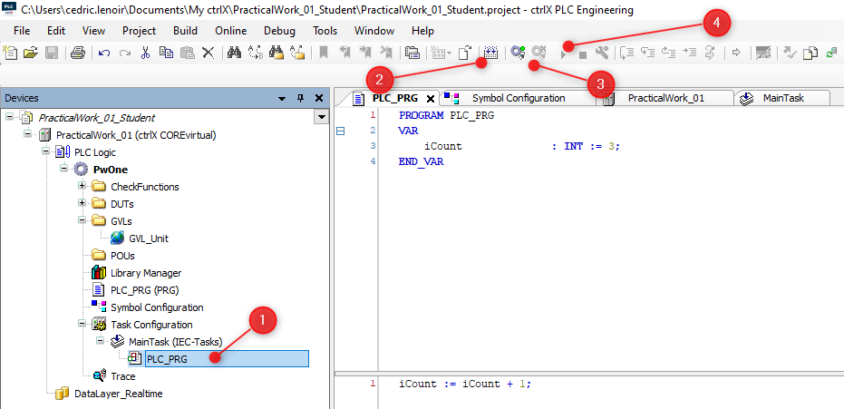
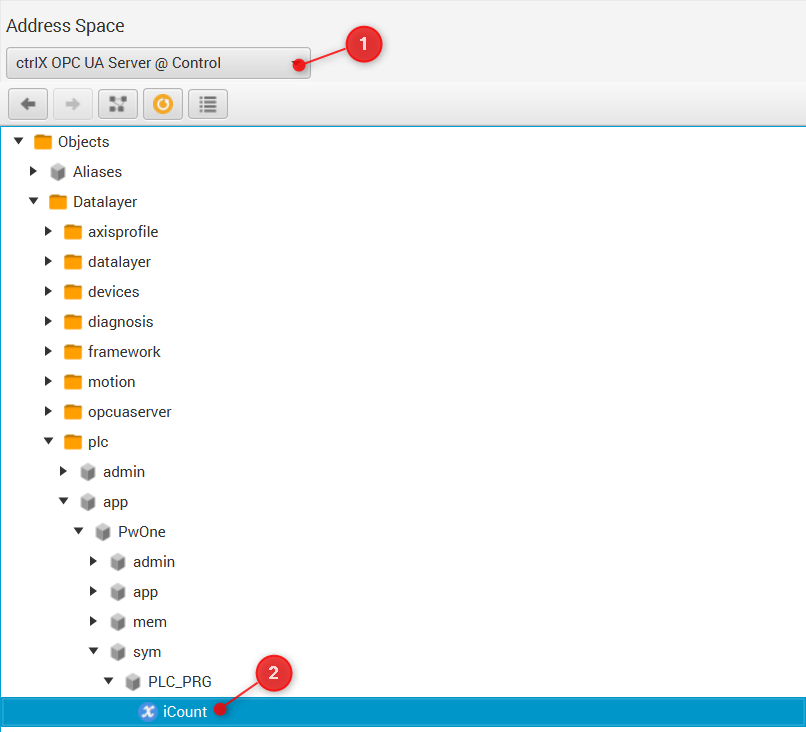
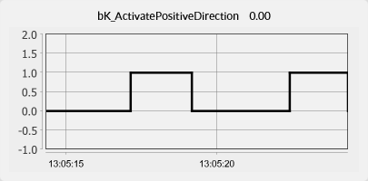
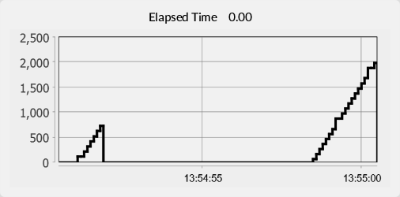

<h1 align="left">
  <br>
  
  <br>
  HEI-Vs Engineering School - Industrial Automation Base
  <br>
</h1>

Cours AutB

Author: [Cédric Lenoir](mailto:cedric.lenoir@hevs.ch)

# LAB 00 Quick Start, a kind of Hello PLC World!

*Keywords:* **IDE OPC UA  HMI FUNCTION BLOCK CYCLIC TASK R_TRIG TON**


*Anhänge:*
-   [QuickStart_ctrlX_PLC to load and upload your first project from archive.](./QuickStart_ctrlX_PLC.md)
-   [QuickStart_ctrlX_PLC_Trace to trace a variable.](./QuickStart_ctrlX_PLC_Trace.md)

# Ziel
Machen Sie sich mit dem Entwicklungssystem vertraut, das während des Semesters verwendet wird, und entdecken Sie einige Grundlagen, die im weiteren Verlauf des Semesters vertieft werden, sei es in der Praxis oder in der Theorie. In Summe:
- Schreiben Sie ein Mini-SPS-Programm.
- Stellen Sie eine **OPC UA**-Kommunikation zwischen der **SPS** und einem **HMI** her.
- Informationen von der **SPS** anzeigen und Befehle senden.

## Als Übung
- Verwenden einen Timer, ``TON``.
- Verwenden einen Auslöser. ``R_TRIG``.
- Programmieren einen diskreten Sinus mit $\ fs = PLC_{CycleTime} $

# Hardware
Unter dem Namen ctrlX Core finden wir ein Echtzeit-Linux-Betriebssystem auf Basis von Ubuntu eingebettet in eine elektrische Achssteuerung. 64-Bit-Quad-Core-ARM-Prozessor.

<figure>
    
    <figcaption>CtrlX CORE Architecture drive based</figcaption>
</figure>

# Logiciels

## ctrlX WORKS
*Version of ctrlX WORKS when writing this document:* **1.16.00**

ctrlX WORKS ist eine Software-Suite zum Programmieren und Verwalten einer ctrlX Core-Assembly:

### Where to download ctrlX Works ?

[Rexroth Store CtrlX Works 1.20.10](https://developer.community.boschrexroth.com/t5/Store-and-How-to/ctrlX-WORKS/ba-p/16448?_gl=1*1bn23o0*_ga*NDYyODk3NjMxLjE2ODg3MzYwODY.*_ga_1TJGXV7Q4B*MTcwOTcxNDgzOS44Mi4xLjE3MDk3MTQ5MzMuMC4wLjA.*_ga_6YFL8JVC3S*MTcwOTcxNDgzOS45NS4xLjE3MDk3MTQ5MzMuMC4wLjA.*_gcl_aw*R0NMLjE3MDYwMjEzOTguRUFJYUlRb2JDaE1JNG9QWTctRHpnd01WeVpSb0NSMVg5d21IRUFBWUFTQUFFZ0tGd2ZEX0J3RQ..*_gcl_au*MTQwNzY2NjMzLjE3MDQ0NDE4NDcuMTUzOTE1ODk3MS4xNzA2MTAxODE5LjE3MDYxMDE4MTk.) Status on March 06, 2024.

## ctrlX WORKS - Device Management

Allgemeine Verwaltung von Geräten, **real oder virtuell**, die mit dem Entwicklungs-PC verbunden sind.

<figure>
    
    <figcaption>ctrlX WORKS - Device Management</figcaption>
</figure>

### ctrlX PLC Engineering

Entwicklungsumgebung, **Integrierte Entwicklungsumgebung**, IDE, in SPS-IEC-Sprache **61131-3**.

<figure>
    
    <figcaption>ctrlX PLC Engineering</figcaption>
</figure>

Der SPS-Teil ist nur eine der Komponenten des Systems.

<figure>
    
    <figcaption>ctrlX CORE PLC Runtime Overview</figcaption>
</figure>

Der SPS-Teil ist nur eine der Komponenten des Systems. Wir könnten uns durchaus dafür entscheiden, die Achsen von anderen Umgebungen aus zu steuern.

## Prosys OPC UA Monitor

<figure>
    
    <figcaption>Prosys Opc Ua Monitor Icon</figcaption>
</figure>

### OPC UA
OPC UA ist ein Informationsaustauschstandard, der auf dem Client-Server-Prinzip basiert, ergänzt durch ein Informationsmodell-Sharing-System, das Ethernet-Unterstützung für den Transport nutzt.

1. In unserer Konfiguration ist der Server die SPS.
2. In unserer Konfiguration ist der Client das HMI.

### HMI
HMI für Mensch-Maschine-Schnittstelle. In der Praxis werden aktuelle HMIs häufig auf WEB-, HTML- und Java-Script-Technologien entwickelt, die keine Technologien sind, die Teil des SYND-Programms für industrielle Systeme sind.

Derzeit basieren immer mehr HMI-Lösungen auf den Konzepten **Low Code** oder **No Code**. Die im Rahmen der praktischen Arbeit vorgeschlagene Lösung ist eine **No-Code**-Lösung. Es bietet die Möglichkeit, über OPC UA auf SPS-Daten zuzugreifen, ohne dass eine einzige Codezeile geschrieben werden muss.

Bei der vorgeschlagenen Lösung handelt es sich um die kostenlose und daher eingeschränkte Version einer Industrielösung. Der Preis einer Lizenz entspricht etwa einem halben Arbeitstag eines Ingenieurs und reicht für viele einfache Anwendungen aus.

<figure>
    
    <figcaption>Prosys Opc Ua Monitor</figcaption>
</figure>

# Hello World von PLC

## Password
Wir hätten Zugangspasswörter so weit wie möglich entfernen können. **Dies ist nicht der aktuelle Automatisierungstrend**.

Wir haben jedoch die Standardpasswörter für die Systeme beibehalten: Entweder:

- Benutzername: **boschrexroth**
- Passwort: **boschrexroth**

Das „Hello World“ der SPS besteht darin, einen Zähler in eine Aufgabe zu schreiben und anhand der Zählererhöhung zu überprüfen, ob die Aufgabe ausgeführt wird.

1. Öffnen Sie ctrlX Works, [Details zum Laden des Programms hier](QuickStart_ctrlX_PLC.md).
2. Wählen Sie die SPS aus, real oder virtuell, an der Sie arbeiten möchten.
3. Wählen Sie die PLC App aus und starten Sie ctrlX PLC Engineering.

## Ecrire un premier programme

```iecst
PROGRAM PLC_PRG
VAR
	iCount    : INT := 3;
END_VAR

iCount := iCount + 1;
```

> In der Programmierumgebung dient der obere Teil eines Programmfensters zum Definieren der Variablen, der untere Teil zum Schreiben des Codes.

<figure>
    
    <figcaption>My First Program In Four Steps</figcaption>
</figure>

1. Select PLC_PRG and write code for counter.
2. Compilation.
3. Download 
4. Run

<figure>
    
    <figcaption>Select: Login with download</figcaption>
</figure>

# HMI-Benutzeroberfläche für *Human Machine Interface* anschließen.

## Verbindung auf SPS-Seite konfigurieren *Programmierbare Logikschnittstelle.*
Damit eine Variable von außen zugänglich ist, muss der Compiler informiert werden, insbesondere damit er sie im **Node Space** OPC UA verfügbar macht.

> Wenn das Symbol **Symbol Configuration** nicht vorhanden ist, müssen Sie es hinzufügen, indem Sie zu IDE -> Registerkarte -> Projekt -> Objekt hinzufügen -> Symbolkonfiguration... gehen.

<figure>
    
    <figcaption>Configure Symbol Configuration</figcaption>
</figure>

> Die geänderte Symbolkonfiguration wird beim nächsten Download oder bei der nächsten Online-Änderung übernommen.

1. Wählen Sie *Symbolkonfiguration*
2. Überprüfen Sie iCount
3. Überprüfen Sie, ob **OPC UA-Funktionen unterstützen** aktiviert ist.
4. Bauen.
5. Die Variable steht nach dem nächsten Download im OPC-Adressraum zur Verfügung.

## Verbinden Sie das HMI mit dem OPC UA-Adressraum
Der Zugriff auf die SPS ist nicht unbedingt trivial. Ein Teil der Komplexität von OPC UA ist das Ergebnis dieser Hauptqualitäten:

1. Der Zugang ist passwortgeschützt.
2. Die Sicherheit wird durch einen Zertifikatsaustausch ergänzt.
3. Die Daten werden zwischen dem Server und dem Client verschlüsselt.

> Wie wir in **Symbol Configuration** gesehen haben, entscheidet der SPS-Programmierer, auf welche Variablen zugegriffen werden kann. Der HMI-Programmierer muss sich dann nur noch mit dem OPC UA-Adressraum verbinden, um **herauszufinden, welche Variablen verfügbar sind**.

Starten Sie **Prosys OPC UA Monitor** und wählen Sie **Source Servers**.
<figure>
    
    <figcaption>Prosys Opc Ua Monitor Icon</figcaption>
</figure>

### Connection Address
```opc.tcp://```IP Address```:4840``` 

- „opc.tcp://“ bedeutet Zugriff über TCP, was grundsätzlich immer der Fall ist.
- Die IP-Adresse kann in Textform vorliegen, zum Beispiel „localhost“, häufiger jedoch in der Form „xxx.xxx.xxx.xxx“, zum Beispiel „192.168.0.200“ für ctrlX Core fährt.
- „4840“ ist die Standard-Portnummer für OPC UA, sie kann jedoch bei Bedarf geändert werden. Beispielsweise wenn mehrere Server unter derselben Adresse verfügbar sind.

<figure>
    
    <figcaption>Add New Source Server Connection</figcaption>
</figure>

#### Certificat client
Möglicherweise müssen Sie das Prosys-Zertifikat in der CTRLx Core-Umgebung validieren.

In ctrlX Core --> Settings --> Certificates & Keys --> OPC UA Server

<figure>
    
    <figcaption>Trust Opc Ua Prosys Certificate</figcaption>
</figure>

> Sie müssen das Serverzertifikat akzeptieren und seinen Platz auf Ihrem PC auf der Registerkarte „Zertifikate“ von Prosys OPC UA Monitor überprüfen.

> In vielen Systemen, wie z. B. Prosys, gibt es einen **abgelehnten Ordner**, es ist manchmal notwendig, ein Zertifikat aus diesem Ordner nach „.\PKI\CA\certs“ zu verschieben, um eine Verbindung zu ermöglichen.

### Signal im Addess Space auswählen
Wählen Sie die Registerkarte **Signalgruppe** und suchen Sie dann im **Adressraum** nach der Variablen „iCount“ unter allen Informationen, die der ctrlX Core OPC UA standardmäßig zur Verfügung stellt.

<figure>
    
    <figcaption>Find iCount In The Address Space Of Opc Ua</figcaption>
</figure>

<figure>
    
    <figcaption>Drag And Drop Signal To Signal Group</figcaption>
</figure>

### Panel Editor
1. Wählen Sie im Panel-Editor ein **+**aus, um den **Signalnamen** von ```iCount``` auszuwählen und den Messgerättyp und die gewünschten Parameter frei zu konfigurieren.

2. Öffnen *Monitoring View*.

<figure>
    
    <figcaption>CtrlX Says Hello World !</figcaption>
</figure>

**Your firt program is ready !**

# Link zur Hardware
Wir sind nicht in der Simulation, wir müssen unsere Software mit der Hardware verbinden.

> Das System ist etwas Besonderes, es ist eine historische Entscheidung, ein Teil der Ausrüstung existierte schon vor der Anschaffung der Roboter und ihrer integrierten SPS, also mussten wir einen Weg finden, die alte Ausrüstung mit der neuen zu verbinden.

> Alle CTRLx Core-Kommunikationstools sind nicht in der endgültigen Version. Dies ist bei **Profinet** der Fall, das eine strikte zyklische Kommunikation mit den Sensoren und Aktoren gewährleistet. **Wir mussten ein bisschen basteln** an der Verwendung von **OPC UA**, das nicht darauf ausgelegt ist, eine stabile Zykluszeit zu garantieren.

> Profinet und OPC UA werden später im Kurs behandelt.

## Programmieren Sie einen Taster
In diesem Teil schreiben wir ein kleines Programm zum Starten und Stoppen des Förderers mit zwei Drucktasten.
1. Es gibt einen **Start**-Druckknopf.
2. Das Förderband startet erst bei steigender Tasterflanke, d.h. wenn die Taste gedrückt bleibt, startet das Förderband nach einem Stopp nicht wieder.
3. Es gibt einen **Stopp**-Druckknopf mit dem gleichen Verhalten wie der Startknopf.

> Steigende oder fallende Flanken sind Klassiker der **SPS**-Programmierung. Dafür gibt es zwei Funktionsblöcke. R_TRIG und F_TRIG.

- R_TRIG für Rise Trigger, steigende Flanke.
- F_TRIG für Fall Trigger, fallende Flanke.

Wir werden zwei **R_TRIG** verwenden, um die steigenden Flanken der Schaltflächen zu erkennen.

Fügen Sie Ihren Variablen zwei Funktionsblöcke hinzu

```iecst
PROGRAM PLC_PRG
VAR
	...
	rTrigStart	: R_TRIG;
	rTrigStop   : R_TRIG;
END_VAR
```

Fügen Sie dann Folgendes in Ihren Code ein

```iecst

(*
	Declaration of all FB at the end of the code, this is a good practice.
	You can lose one cycle but the program is more readable.

    But !
    Triggers are exceptions:
        because the output .Q is only active in the current cycle
*)
rTrigStart(CLK:=GVL_Abox.uaAboxInterface.uaButtonAndSignal.In_Start);
rTrigStop(CLK:=GVL_Abox.uaAboxInterface.uaButtonAndSignal.In_Stop);

IF rTrigStart.Q THEN
	TagOut.K1_DirectionOutput := TRUE;
END_IF

IF rTrigStop.Q THEN
	TagOut.K1_DirectionOutput := FALSE;
END_IF

```
Complete your **Symbols** and **HMI** to Start/Stop the conveyor.

<figure>
    
    <figcaption>Monitor Activation Of Conveyor</figcaption>
</figure>

> Beobachten Sie **sehr sorgfältig** das Verhalten Ihres Diagramms!

1. OPC UA ist **nicht Echtzeit**.
2. OPC UA ist **nicht zyklisch**.
3. OPC UA sendet Daten **nur, wenn sie sich ändern**.
4. OPC UA ist **nicht für die Steuerung konzipiert**, sondern für HMI, Parameter oder Daten ohne strenge Timing-Anforderungen.

> Es gibt viele Studien mit einer Erweiterung von OPC UA, **OPC UA PubSub**, die sich vom klassischen Client-Server-Modell unterscheidet. Ziel ist die Nutzung von OPC UA PubSub mit Echtzeit-Ethernet-Netzwerken. Beispiel: [OPC UA PubSub über TSN für industrielle Echtzeitkommunikation](./pdf/OPC%20UA%20PubSub%20over%20TSN%20for%20Realtime%20Industrial%20Communication.pdf). **Im Jahr 2024 sind noch keine kommerziellen Anwendungen verfügbar**.

# Nächster Schritt: Stellen Sie einen Timer ein
Der **Timer** ist ein weiterer typischer Funktionsblock der **SPS**-Programmierung. Sie verwenden einen, um einen **Timer** einzustellen, der das Förderband nach einer bestimmten Zeitspanne stoppt.

## Vervollständigen Sie Ihren Code wie folgt:

```iecst
PROGRAM PLC_PRG
VAR
    ...

	// To stop conveyor after a selected time if active.
	tonConveyorStop : TON;
END_VAR
```

```iecst
(*
    Note the OR used to stop with two different conditions.
*)
IF rTrigStop.Q       OR
   tonConveyorStop.Q THEN
	TagOut.K1_DirectionOutput := FALSE;
END_IF

(*
	Declaration of all FB at the end of the code, this is a good practice.
	You can lose one cycle but the program is more readable.
*)
...
tonConveyorStop(IN := TagOut.K1_DirectionOutputn,
                PT := T#2S);
```
> **PT** pour **Heure programmée**. Notez le format ``T#``*valeur*``unité``

> **Q** für **Ausgabebit** wird verwendet, da der **O**, *Buchstabe*, mit einer **0**, *Wert*, verwechselt werden könnte. Für Binärwerte, ```BOOL```, **bevorzugen wir in der SPS-Programmierung ```TRUE``` und ```FALSE```, obwohl auch 0 und 1 verwendet werden könnten.

## Nutzen Sie die Zeit und die Zeit auf einer Grafik
Der Funktionsblock ```TON``` dient dazu, die Taste ```ET``` zu überwachen und die Zeit nach der Aktivierung der Minute zu überwachen, bis die Taste ```Q``` auf ```TRUE``` festgelegt ist.

Vervollständigen Sie den Code, die Symbole und den OPC UA-Monitor, um die gewünschte Option anzuzeigen.

<figure>
    
    <figcaption>Monitor Elapsed Time</figcaption>
</figure>

# Finaly, write a sinus generator
Das Ziel besteht darin, den Unterschied zwischen einem Signal, das Sie mit einem Matlab-Skript mit einer *for-Schleife* erzeugen könnten, und einem Signal mit der SPS zu verstehen, das **IST** eine Form einer Endlosschleife ist, das heißt, Sie müssen es nicht tun Verwenden Sie eine *for-Schleife*.

- Die Amplitude des Signals muss ```24 [Vdc]``` betragen.
- Die Frequenz des Signals muss ```0,5 [Hz]``` betragen.
- Die SIN-Funktion in der SPS funktioniert wie die Sin-Funktion in Matlab, im Bogenmaß.
- Pi wird als Konstante angegeben.

> Unten finden Sie ein Beispiel für ein Skript mit Matlab. Sie müssen lediglich die Entwicklung des Winkels in Abhängigkeit von der Zykluszeit berücksichtigen, um ```0,5 [Hz]``` zu erhalten.

<figure>
    
    <figcaption>Monitor Sinus</figcaption>
</figure>

Sie müssen die Zykluszeit der auszuführenden Aufgabe überprüfen ``10 [ms]``.
<figure>
    
    <figcaption>Check Task Cycle Time</figcaption>
</figure>

### Vervollständigen Sie Ihren Code mit den verwendeten Variablen
> PI ist eine Konstante, Sie können die Präzision vervollkommnen, wenn Sie sie suchen.

```iecst
PROGRAM PLC_PRG
VAR
    ...
	rMyValue_rad		: REAL;
    rMySinus            : REAL;
END_VAR

VAR CONSTANT
	rMyPi			    : REAL := 3.1416;    
END_VAR
```

### The Matlab script with its output.
```Matlab
% Sample Time 10 ms = 10/1000
sampleTime_s = 0.01;
% Frequency of the signal
frequency_Hz = 2;
% Reserve a vector of size 100, Content is irrelevant
mySinus = 1:1:100;
time = 1:1:100;

for i = 1:100
    myAngle_rad = 2 * pi * i * sampleTime_s * frequency_Hz;
    time(i) = i * sampleTime_s;
    mySinus(i) = 24 * sin(myAngle_rad);
end
% The signal with completed points between samples
plot(time,mySinus), grid on;
% The same, but with samples only
plot(time,mySinus,"."), grid on;
```

<figure>
    
    <figcaption>Matlab Plot Sinus</figcaption>
</figure>

# Trace Sinus
Verfolgen und interpretieren Sie das Sinussignal, siehe [Anhang QuickStart_ctrlX_PLC_Trace](./QuickStart_ctrlX_PLC_Trace.md).

# Rapport
> Ich habe keine Beziehung zu diesen praktischen Arbeiten, aber **die praktischen Arbeiten werden nicht erfasst. Cela fait partie de la théorie**.

> Auf Anfrage kann die verwendete Logik jetzt für eine Installation auf Ihrem tragbaren Gerät verwendet werden. Windows-Einzigartigkeit, für ctrlX Works.

> Am Ende des Kurses müssen Sie in der Lage sein, den strukturierten Code einfach zu schreiben, ohne ihn vom Texteditor importieren zu müssen.
